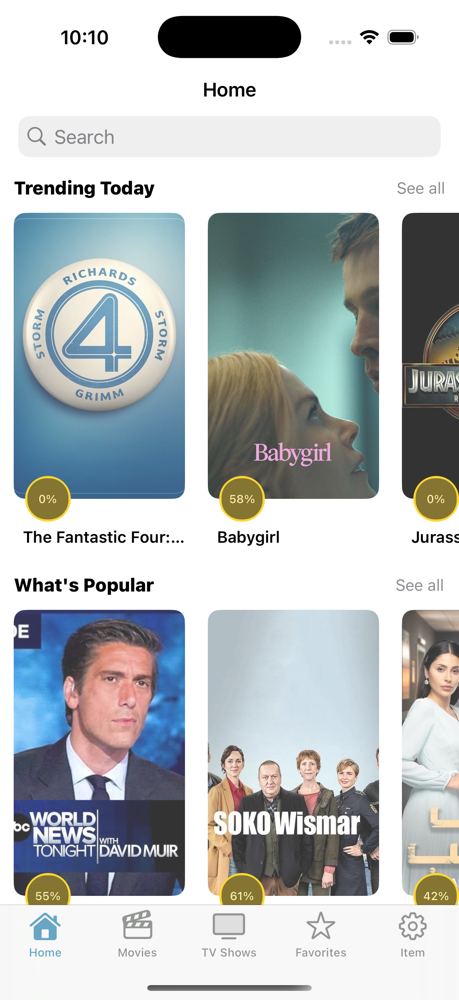
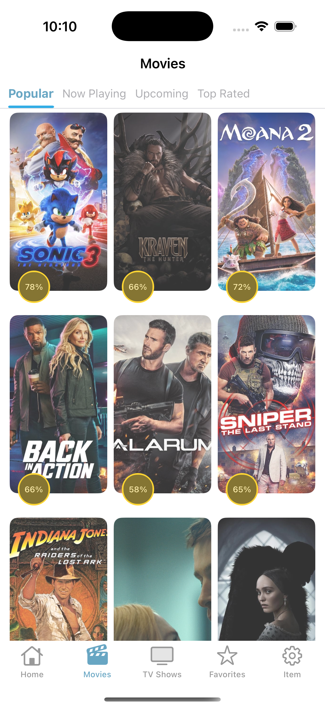
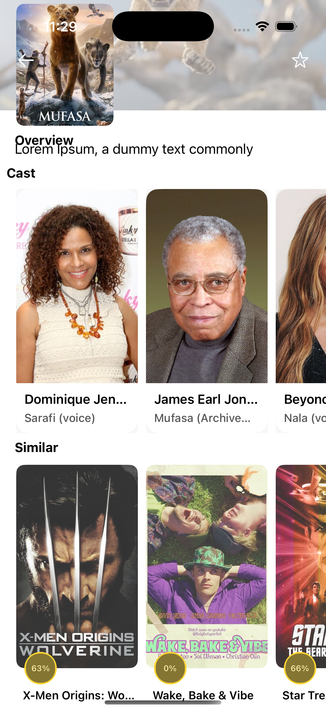
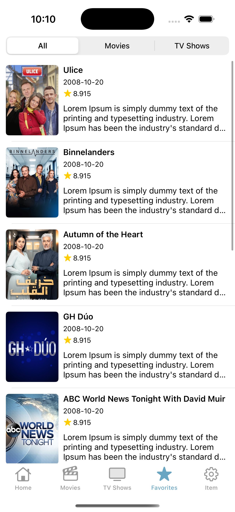

# Movie App
Movie app for iOS

## Overview
The Movie app is an iOS application built using UIKit and Combine frameworks. It is designed to seamlessly display a wide range of movies by fetching data from the MovieDB API. Through the use of Combine, the app handles asynchronous data streams efficiently, ensuring smooth interaction with the API and dynamic updates to the UI. This combination of UIKit for the user interface and Combine for managing data flow creates a responsive and user-friendly experience for browsing and viewing movie information.

### Screenshots

<h4 align="center">
 

 

